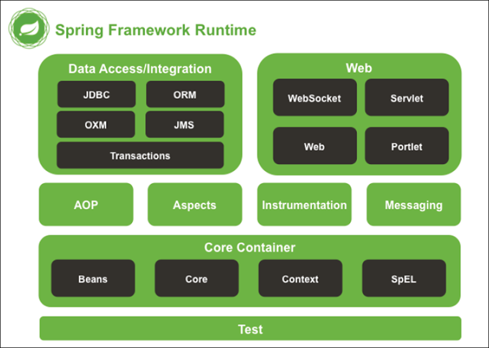

# Spring

Spring es un framework para el desarrollo de aplicaciones y contenedor de inversión de control, de código abierto para la plataforma Java 

## Spring fundamentos

El corazón de Spring Framework es su contenedor de inversión de control (IoC). Su trabajo es instanciar, inicializar y conectar objetos de la aplicación, además de proveer una serie de características adicionales disponibles en Spring a través del tiempo de vida de los objetos.

En una aplicacion Spring pura, podemos desarrolar todo nuestro codigo sin necesidad de que el programador haga "news" de los objetos, será el contenedor de spring el que haga este trabajo. Nosotros como programadores, programaremos los objetos o las clases pero el control del ciclo de vida de los objetos ser encargara Spring

La inversion de control es un concepto el cual el programador no tiene el control sobre el ciclo de vida del objeto, sino que es otra entidad el que lo tiene (en este caso, Spring)

1. La instanciacion de los objeto corre a cargo de una clase llamada BeanFactory. En principio tenemo tres maneras de dar de alta los objetos en el contexto de spring. 
    - La primera sería a traves de XML
    - la segunda sería a traves de anotaciones. 
    - La tercera basandonos en objetos Java (desde Spring 3.0)

Cuando nosotros tabajamos con objetos dentro del contexto de Spring, los objetos dejan de ser anonimos y pasan a tener un identificador unico, de tal manera que podemos pedirle al contexto de spring ese objeto siempre que queramos.

2. El lugar donde se van a guardar los objetos, es el ApplicationContext, que podemos darlo de alta a traves de un XML o a traves de anotaciones. El contenedor es unico para toda la aplicacion. El usuario puede usar el formato que desee para dar de alta los ojbetos e incluso mezclarlos en la misma aplicación.​

Los objetos creados y gestionados por el contenedor se denominan objetos gestionados o beans. Estos objetos normalmente son del tipo POJO (Plain Old Java Object), es decir, objeto sencillos que no tienen herencias ni interfaces.
​
Los objetos pueden ser obtenidos por búsqueda de dependencias o por inyección de dependencias. 

1. búsqueda de dependencias es un modelo donde se pide al objeto contenedor un objeto con un nombre específico o de un tipo específico, ya que recordemos que los beans en spring no son anonimos como en java. i
2. inyección de dependencias es un modelo en el que el contenedor pasa objetos por nombre a otros objetos, ya sea a través de métodos constructores, propiedades, o métodos de la fábrica.

## Spring runtime

En la siguiente clase podemos ver los modulos más importantes que intervienen en Spring

## Configurar un proyecto Spring

Tenemos que bajarnos la librerías con el contexto de spring. Normalmente haremos esto mediante maven y actualizaremos la version de java

	  <properties>
	    <maven.compiler.source>11</maven.compiler.source>
	    <maven.compiler.target>11</maven.compiler.target>
	  </properties>
	  
	  <dependencies>
	  	<!-- https://mvnrepository.com/artifact/org.springframework/spring-context -->
		<dependency>
		    <groupId>org.springframework</groupId>
		    <artifactId>spring-context</artifactId>
		    <version>5.2.18.RELEASE</version>
		</dependency>
	  	
	  </dependencies>
	  
Tambien se recomienda tener el plugin de eclipse llamado "Spring Tools 4" que se puede bajar del marketplace de Eclips -> help | Eclipse Marketplace

## Ejemplos spring

En este proyecto tenemos diferentes ejemplos sobre los distintos casos de dar de alta el contexto de aplicacion por XML y los beans (objetos spring) por XML.

Cada ejemplo es independient de los demás.

​